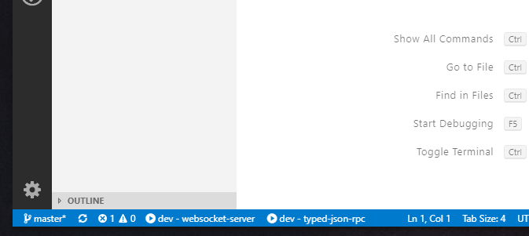

# Tasks Statusbar

This extension adds buttons to the status bar to quickly start and kill tasks.
A regular expression can be specified to filter available tasks.

## Extension Settings

This extension contributes the following settings:

* `tasksStatusbar.taskLabelFilter`: A regular expression that filters the tasks to show in the status bar by their name. Defaults to `dev|watch`.
* `tasksStatusbar.nameTemplate`: A template for the name of the status bar item. Refer with `$i` to the i-th captured group of the task label filter.

## Known Issues

No known issues yet.

You could vote for [this issue](https://github.com/Microsoft/vscode/issues/27196) which would enable me to make this extension even greater.

## Release Notes

### 0.1.0

Initial release
